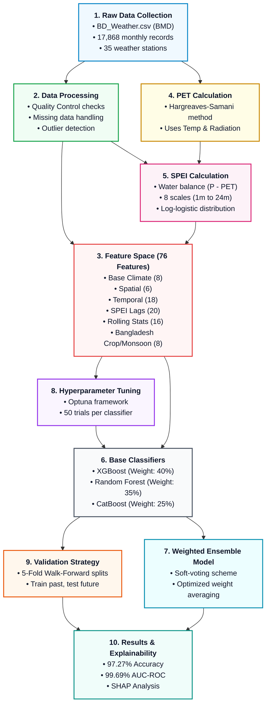

# Guide: Designing the Methodology Flowchart (V2 Pipeline)

This guide provides the exact logical flow, content, and step-by-step connections for the **Ensemble Machine Learning Framework for Drought Classification**. 

The arrows in the previous auto-generated plot were reversed (pointing backward), which caused confusion. Use this step-by-step breakdown to draw a clean, professional, and publication-ready diagram using design tools like **Canva**, **Draw.io (Diagrams.net)**, or **Lucidchart**.

---

## 🛠️ Recommended Diagramming Tools

1. **Draw.io (Diagrams.net) [Recommended for Papers]**
   - **Why:** 100% free, exports clean SVG/PDF vectors, and aligns grids automatically.
   - **How:** Go to [draw.io](https://app.diagrams.net/), and you can import the **Mermaid Code** (below) via `+` -> `Advanced` -> `Mermaid` to instantly generate the layout.
2. **Lucidchart or Miro**
   - **Why:** Extremely clean modern aesthetics, easy drag-and-drop connectors.
3. **Canva**
   - **Why:** Best for custom colors and custom fonts (e.g., Inter, Outfit).
   - **How:** Search for "Flowchart" templates, select a minimalist layout, and use the step-by-step configuration below.

---

## 📊 Step-by-Step Flowchart Structure

The methodology operates in **4 sequential tiers** (from top to bottom).

### Tier 1: Data Acquisition & Preprocessing (Start)
* **Box 1: Raw Data Collection**
  * **Title:** `Raw Meteorological Data`
  * **Content:**
    * BD_Weather.csv (Bangladesh Meteorological Department)
    * 17,868 monthly records (1961–2023)
    * 35 active weather stations
    * Daily variables: Rainfall (P), Temperature (Tmin, Tmax), Relative Humidity (H), Sunshine (S)
  * **Connection:** Points directly to **Box 2** (Data Processing) and **Box 4** (PET Calculation).

* **Box 2: Data Processing**
  * **Title:** `Data Processing & Aggregation`
  * **Content:**
    * Quality Control (QC) checks & homogenization
    * Missing data interpolation
    * Outlier detection & correction
    * Aggregation of daily values to monthly values
  * **Connection:** Points directly to **Box 3** (Feature Engineering) and **Box 5** (SPEI Calculation).

---

### Tier 2: Meteorological Index Calculations
* **Box 4: PET Calculation** (Calculated from Raw Data)
  * **Title:** `Potential Evapotranspiration (PET)`
  * **Content:**
    * Hargreaves-Samani method
    * Inputs: Mean/Min/Max Temperature, Extraterrestrial Radiation ($R_a$)
    * Output: Monthly atmospheric evaporative demand
  * **Connection:** Points directly to **Box 6** (Machine Learning Features input).

* **Box 5: SPEI Calculation** (Calculated from Processed Data & PET)
  * **Title:** `SPEI Calculation (8 Scales)`
  * **Content:**
    * Water Balance calculation ($D = P - PET$)
    * Log-logistic probability distribution fitting
    * Scales: 1, 2, 3, 6, 9, 12, 18, 24 months
    * Moderate Drought Threshold definition: $SPEI \leq -0.5$
  * **Connection:** Points directly to **Box 7** (Ensemble Model target labeling).

---

### Tier 3: Feature Engineering & Feature Selection
* **Box 3: Feature Engineering**
  * **Title:** `Feature Space (76 Features)`
  * **Content:**
    * Base Climate: Rainfall, Temp, PET (8 features)
    * Spatial Context: Coordinates, Elevation, Coastal distance (6 features)
    * Temporal Context: Month, Year, Season, Sine/Cosine transforms (18 features)
    * SPEI Lags: 20 lag terms ($\Delta t \geq 3$ months) (20 features)
    * Rolling Statistics: 3m & 6m window statistics (16 features)
    * Bangladesh-Specific: Crop Seasons (Aman/Aus/Boro), Monsoons (8 features)
  * **Connection:** Points directly to **Box 8** (Hyperparameter Tuning) and **Box 6** (Machine Learning Model training).

---

### Tier 4: Model Training, Ensemble, & Evaluation
* **Box 8: Hyperparameter Optimization**
  * **Title:** `Hyperparameter Optimization`
  * **Content:**
    * Optuna tuning framework
    * 50 trials per individual base classifier
    * Optimization metric: Log-loss minimization
  * **Connection:** Points to **Box 6** (Machine Learning base models configuration).

* **Box 6: Base Machine Learning Classifiers**
  * **Title:** `Base Classifiers`
  * **Content:**
    * **XGBoost** (Optimized, Weight: 40%)
    * **Random Forest** (Optimized, Weight: 35%)
    * **CatBoost** (Optimized, Weight: 25%)
  * **Connection:** Points directly to **Box 7** (Ensemble Classifier) and **Box 9** (Temporal Cross-Validation).

* **Box 7: Ensemble Framework**
  * **Title:** `Weighted Voting Ensemble`
  * **Content:**
    * Soft-voting prediction averaging
    * Meta-weights optimized via grid search
    * Decision threshold tuning for class imbalance
  * **Connection:** Points directly to **Box 10** (Final Results).

* **Box 9: Validation Strategy**
  * **Title:** `Temporal Cross-Validation`
  * **Content:**
    * 5-Fold Walk-Forward splits
    * Strict chronological partition (Train: Past $\rightarrow$ Test: Future)
    * Prevents data leakage from lag features
  * **Connection:** Links to **Box 10** (Final Results evaluation).

* **Box 10: Evaluation & Explanations (End)**
  * **Title:** `Results & Explainability`
  * **Content:**
    * Mean Accuracy: **97.27%**
    * Mean AUC-ROC: **99.69%**
    * Global feature attribution via SHAP Analysis
    * Local prediction explanations
  * **Connection:** (End of flow).

---

## 📐 Arrow Connection Reference Table

For drawing in Canva or Draw.io, connect the boxes in this exact sequence:

| Source Box | Destination Box | Meaning |
| :--- | :--- | :--- |
| **Box 1 (Raw Data)** | **Box 2 (Data Processing)** | Clean and structure the raw meteorological records |
| **Box 1 (Raw Data)** | **Box 4 (PET Calculation)** | Feed temperature parameters to compute evaporation demand |
| **Box 2 (Data Processing)** | **Box 3 (Feature Space)** | Aggregate values to construct base temporal/spatial features |
| **Box 2 (Data Processing)** | **Box 5 (SPEI Calculation)** | Calculate water balance ($P - PET$) for index scales |
| **Box 4 (PET Calculation)** | **Box 5 (SPEI Calculation)** | PET is subtracted from Rainfall to compute water deficit ($D$) |
| **Box 5 (SPEI Calculation)** | **Box 3 (Feature Space)** | Construct past historical SPEI lag features ($\geq 3$ months) |
| **Box 3 (Feature Space)** | **Box 8 (Hyperparameter Tuning)** | Run Bayesian search on engineered feature subsets |
| **Box 8 (Hyperparameter Tuning)** | **Box 6 (Base Classifiers)** | Load optimized parameters into XGBoost, Random Forest, & CatBoost |
| **Box 3 (Feature Space)** | **Box 6 (Base Classifiers)** | Feed the 76 features matrix for model training |
| **Box 6 (Base Classifiers)** | **Box 7 (Weighted Ensemble)** | Combine class probability outputs using optimized weights |
| **Box 6 (Base Classifiers)** | **Box 9 (Temporal CV)** | Validate base models with strict chronological splits |
| **Box 9 (Temporal Cross-Val)** | **Box 10 (Results & SHAP)** | Evaluate the ensemble model's final metrics on unseen test folds |

---

## 🧬 Mermaid Code (Instant Diagram Generation)

Paste the code below directly into [Mermaid Live Editor](https://mermaid.live) or the **Draw.io** Mermaid input tool:

